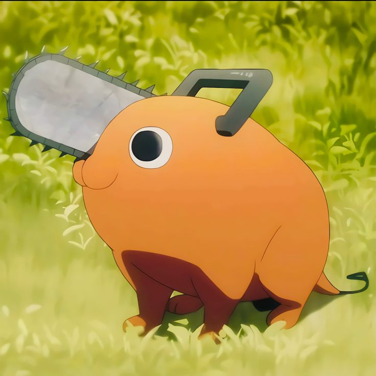

# Chain_Saw

The Shiny Chainsaw (Denji) is a Mythical Limited unit featured in Anime Adventures. This character, based on Denji from Chainsaw Man, is a high-tier unit, classified as A+ in terms of value. It requires a deployment cost of 1,300¥, and upgrading the unit across its 8 levels costs a total of approximately 49,750¥. The Shiny Chainsaw (Denji) primarily deals physical damage and is currently valued at around 400 Mush. The demand for this unit is moderate, scoring a 4 out of 10.

